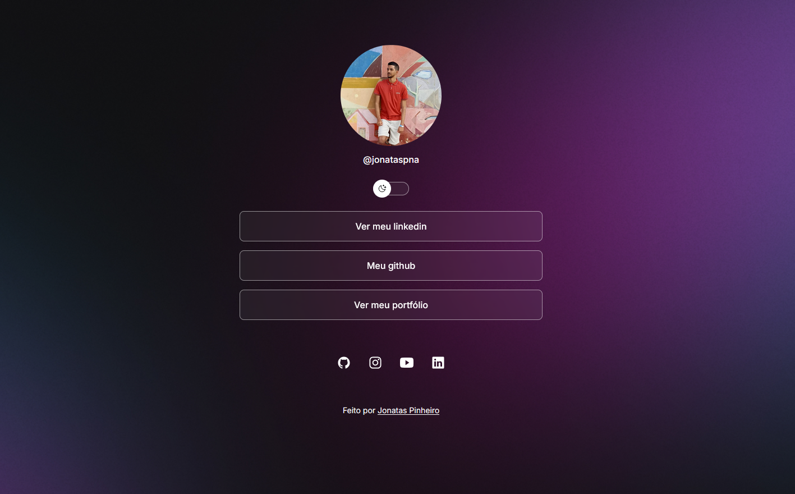

# 🌐 DevLinks

Um **agregador de links** moderno para usar como **cartão de visitas online**.  
Com ele, você pode centralizar todos os seus links em um único lugar, de forma simples e estilosa.  

---

## 🚀 Tecnologias

Este projeto foi desenvolvido com as seguintes tecnologias:

- **HTML** e **CSS**
- **JavaScript**
- **Git** e **GitHub**

---

## 💻 Projeto

O **DevLinks** é uma página pessoal de links que pode ser usada como cartão de visitas digital.  
Ideal para compartilhar seus perfis, portfólio, contatos e redes sociais em um só lugar.

🔗 **Acesse o projeto finalizado online:**  
👉 [Clique aqui para ver o projeto](https://jonatasanp.github.io/DevLinks)

---

## 📷 Preview

---

## 🧠 Aprendizado

Durante o desenvolvimento deste projeto, foram praticados conceitos de:
- Estruturação semântica com HTML
- Estilização responsiva com CSS
- Manipulação de elementos com JavaScript
- Versionamento com Git e publicação no GitHub Pages

---

## 🧑‍💻 Autor

Feito com 💙 por **[Jonatas Pinheiro](https://github.com/jonatasanp)**  
Se quiser trocar uma ideia ou contribuir, fique à vontade para entrar em contato!

---
